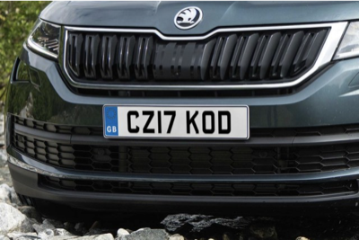
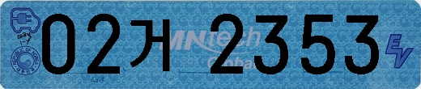
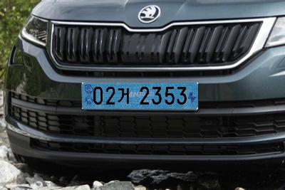

# Electronic Car Generate

전기차 이미지 생성  
[Car License Plate Detection](https://www.kaggle.com/andrewmvd/car-plate-detection) 을 이용 자동차 번호판을 랜덤 생성된 [전기차량 번호판](https://github.com/forallx94/Korean-license-plate-Generator)으로 대체 전기 차량 이미지를 생성

|항목|image|
|-----|-----|
|원본||
|전기차 번호판||
|생성 전기차||

# Reference
* Eletronic_car_plate_generate : https://github.com/forallx94/Korean-license-plate-Generator
* Car License Plate Detection : https://www.kaggle.com/andrewmvd/car-plate-detection
* Cars Dataset : http://ai.stanford.edu/~jkrause/cars/car_dataset.html